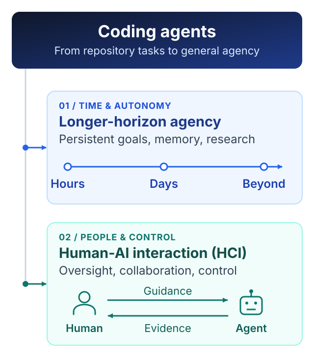

# Software Engineering Research Is Dead

Software engineering research is dead. Or, more precisely, it was already dying long before LLMs arrived. What LLMs did was not kill it, but briefly drag it back into the center of attention.

Before the current AI wave, software engineering research had already become a fairly self-contained academic ecosystem. The conferences were still there, the papers were still being published, and there was no shortage of new tools, taxonomies, benchmarks, user studies, and empirical analyses. But it was hard to avoid the feeling that many of the questions had become increasingly local: how developers navigate code, how they search APIs, how they review patches, how they debug, how they manage dependencies, how they interact with IDEs. These are all real engineering problems, but they are not necessarily frontier scientific problems. A field can be active without being central.

Then LLMs showed up, and suddenly code became one of the hottest things in AI. This was not because the AI community suddenly developed a deep appreciation for decades of software engineering research. It was because code turned out to be an unusually good environment for building and evaluating intelligent agents. Code is executable. It gives fast feedback. There are compilers, tests, debuggers, repositories, issue trackers, dependency graphs, and relatively objective notions of success and failure. An agent can inspect an environment, make a change, run something, observe the result, and try again. Compared with many real-world domains, software is almost absurdly convenient.

That is why SWE-bench mattered. It pushed the community beyond toy code generation and toward something closer to actual problem solving: reading an unfamiliar repository, understanding a task, locating the relevant code, editing multiple files, running tests, recovering from failure. For a while, it made software engineering look like the center of the agent world. But I think the field misread what was happening. AI was not moving toward software engineering. It was moving through software engineering.

The distinction matters. Code is a great training ground for agency, but it is not the final destination of agency. The interesting question is not whether a model can fix another GitHub issue. The interesting question is whether a model can maintain goals, gather information, make decisions, recover from mistakes, use tools, learn from feedback, and remain coherent over long periods of time. Software repositories happen to be one of the easiest places to study these abilities today. That does not mean the repository is the natural boundary of intelligence.

This is also why I am increasingly skeptical of the endless expansion of SWE-bench-style research. Every time models get better, we make the benchmark harder. The issue description is too informative, so remove information. The repository is too small, so use a bigger one. The visible tests are too helpful, so hide them. The agent succeeds with a strong scaffold, so weaken the scaffold. It has enough context, so restrict context. It still succeeds, so invent another benchmark. None of this is automatically useless, but at some point you have to ask whether you are measuring a deep scientific problem or simply moving the finish line to preserve the problem.

A lot of current software engineering research has this uncomfortable property: if the next generation of models becomes much stronger, the research question may simply disappear. Models cannot migrate an API across a repository, so we create a specialized method for repository-wide migration. Models miss relevant files, so we build retrieval systems. Models forget constraints, so we design planning frameworks. Models produce bad patches, so we add reviewer agents. Models lose track of long tasks, so we add memory systems. Again, these are useful engineering responses to current limitations. But current model limitations are not automatically enduring scientific abstractions. Machine learning has seen this movie many times. Feature engineering looked fundamental until representation learning absorbed it. Large parts of classical NLP looked permanent until scale ate them. There is no reason to assume software engineering is somehow exempt.

Meanwhile, the AI frontier is already moving toward problems that are obviously larger than software engineering. AI4Math, AI4Science, autonomous research, long-horizon agents, persistent memory, continual learning, self-improvement, world models, multi-agent coordination. A serious autonomous scientist will obviously write code, but writing code will be only one thing it does. It will read papers, generate hypotheses, design experiments, allocate compute, inspect failures, update its beliefs, coordinate other agents, and decide what to try next. At that point, coding is no longer the research problem. It is just one action primitive.

The same thing is happening from the human side. Take code review. Today we frame the problem as finding defects in a patch. But if agents start producing huge implementations autonomously, with hundreds of tool calls and long internal trajectories, the real problem becomes something much broader: how does a human supervise work they cannot fully inspect? How do we know why an agent made a decision? What evidence should it expose? When should it ask for clarification? How do we calibrate trust? How do we keep humans in control when the amount of machine-generated work exceeds human review capacity? These are not really “code review” questions anymore. They are questions about oversight, interpretability, reliability, human–AI interaction, and control. They just happen to show up in coding early because coding agents are currently among the most capable agents we have.

*Two complementary directions beyond coding: agents that act coherently for longer, and interfaces that keep humans able to supervise and steer their work.*

This is where I think software engineering research faces a fairly brutal choice. It can keep defending its boundaries, keep producing harder repository benchmarks, keep renaming general agent problems with software-engineering terminology, and keep treating every weakness of current models as a new subfield. Or it can follow the abstraction upward. If code search is really a memory problem, study memory. If debugging is really hypothesis search, study hypothesis search. If code review is becoming scalable oversight, study scalable oversight. If repository-level coding is becoming long-horizon agency, study long-horizon agency. If autonomous programming starts merging with autonomous research, then go study autonomous research.

The uncomfortable question I would ask any software engineering researcher today is simple: if models became dramatically better tomorrow, would your research problem still exist? Not whether you could make the benchmark harder. Not whether there would still be corner cases. Not whether you could impose more realistic constraints. Would the underlying problem still matter? If the answer is no, then maybe you are not studying a fundamental problem. Maybe you are documenting the current model’s expiration date.

None of this means software engineering itself is dying. Software will remain everywhere. Reliable systems, infrastructure, distributed systems, programming languages, security, databases, verification, and good engineering will continue to matter enormously. But “software is important” does not imply that software engineering research will remain an intellectual frontier. Those are different claims. Cars are important too; that does not make every research question about how humans manually operate cars permanently central.

ICSE, FSE, ASE and the rest will of course continue. There will be more papers, more workshops, more datasets, more benchmarks, more taxonomies, more “first large-scale empirical studies.” Academic fields are very good at reproducing themselves. But publication volume is not the same thing as frontier relevance. A community can remain institutionally healthy while the most interesting scientific questions quietly move somewhere else.

That, in my view, is exactly what happened to software engineering research before LLMs, and it may be happening again now. LLMs gave the field a second life because code suddenly became one of the best environments for training and testing agents. SWE-bench, coding agents, repository-level reasoning, tool use and execution feedback all became important. For a few years, software engineering found itself unusually close to the center of AI.

But proximity to the frontier is not ownership of the frontier.

The frontier is moving toward systems that operate for hours, days, and eventually much longer; systems that do mathematics and science, manage memory, collaborate with humans, conduct experiments, improve themselves, and act in environments much larger than a Git repository. Software will still be part of that world, probably a very important part. But it will increasingly look like a substrate rather than the scientific question itself.

So no, LLMs did not kill software engineering research. They gave it CPR. The question is what happens when the AI community no longer needs the training wheels.
